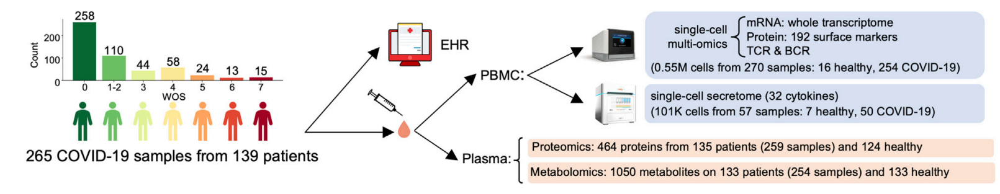
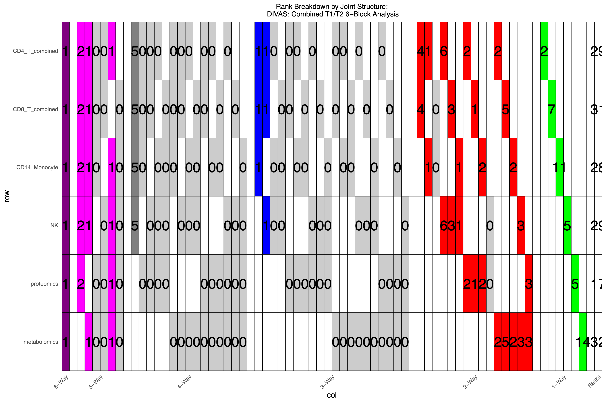
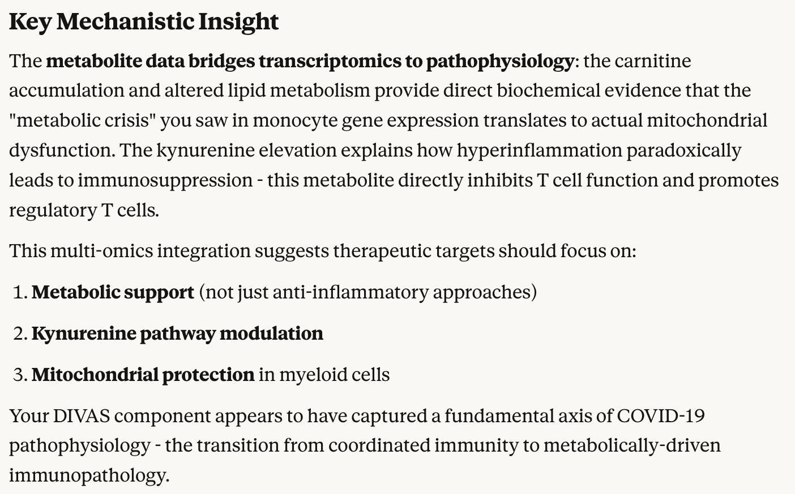

```{r setup, include=FALSE}
knitr::opts_chunk$set(echo = TRUE, warning = FALSE, message = FALSE)
```

In this case study, we applied DIVAS to multiomics data from a cohort of \~120 COVID-19 patients to identify multiomic markers and pathways associated with COVID severity. Compared to the cell type by cell type and omics by omics approach used in the original publication [(Su et al., 2020)](https://www.cell.com/cell/fulltext/S0092-8674(20)31444-6?_returnURL=https%3A%2F%2Flinkinghub.elsevier.com%2Fretrieve%2Fpii%2FS0092867420314446%3Fshowall%3Dtrue), by using DIVAS we can uncover markers and pathways in one go in a way that's **tuning-parameter-free**.

```{r load-packages}
# Load required packages
suppressPackageStartupMessages(library(DIVAS))
suppressPackageStartupMessages(library(vizOmics))
suppressPackageStartupMessages(library(tidyverse))
suppressPackageStartupMessages(library(RColorBrewer))
suppressPackageStartupMessages(library(clusterProfiler))
suppressPackageStartupMessages(library(org.Hs.eg.db))
```


# Dataset

## Background: disease state shift among COVID-19 patients

In December 2020, while COVID-19 was still raging across the globe, [Su et al. (2020)](https://www.cell.com/cell/fulltext/S0092-8674(20)31444-6?_returnURL=https%3A%2F%2Flinkinghub.elsevier.com%2Fretrieve%2Fpii%2FS0092867420314446%3Fshowall%3Dtrue) published their pioneering study examining the immune and metabolic landscapes of mild to severe COVID patients. Based on single-cell RNA and protein data (CITE-seq), they characterised immune cell type compositions in patients. Based on bulk proteomics and metabolomics data, they've also identified the loss of metabolites and metabolic processes accompanying the increase of disease severity. 

While being a highly informative study, their bioinformatic approach is a bit fragmented and manual. They did not really use any data-driven tool to integrate their multiomics data. This is a common pattern for current multiomic studies. One of the motivations for DIVAS is to provide a data-driven and one-stop solution to the identification of interesting multiomic patterns in data.


## Study design

```{r study-design, out.width="100%", echo=FALSE}

```

The study included 139 patients measured at two time points, T1 and T2, resulting in 265 patient samples. Measurements of multiple omics types were available for these patients, we selected scRNA-seq, bulk proteomics and bulk metabolomics as input to DIVAS. The number of patients with all three types of omics was 120; the total number of samples were therefore 240 (two time points).    
Note that there were also 258 healthy controls, but there were only single omics data from these controls. Hence we did not include any healthy control samples in our case study.


## Harmonising different data granularities

DIVAS takes data matrices with the same number of columns (samples) as input, where each matrix represents omic features or clinical variables (metadata) of the same samples. In the COVID study, different omic types had different granularities: scRNA-seq was measurement of gene expression for individual cells, whereas proteomics and metabolomics were patient-level bulk measurements.

To harmonise different data granularities and to prepare data matrices as input to DIVAS, we use the following approach to pseudobulk scRNA-seq data:

1. Conduct cell type annotation using CellTypist using COVID reference.
2. Calculate average gene expression profiles of CD4 T, CD8 T, CD14 Monocyte and natural killer (NK) cells from each individual sample. 

As a result, for each sample (a patient measured at a given time point), we obtained 4 vectors representing the average gene expression profiles of CD4, CD8, CD14 and NK cells. In addition, for each sample we also had two vectors from proteomics and metabolomics, respectively. Thus in total we have **6 modalities**:

1. CD4 gene expression (GEX);
1. CD8 GEX;
1. CD14 GEX;
1. NK GEX;
1. Proteomics (Prot);
1. Metabolomics (Metab).


# What will DIVAS do

As a matrix factorisation algorithm, DIVAS will search components explaining jointly shared, partially shared and individual variations among these modalities. These include

- *Jointly shared*: latent factors shared by all 6 modalities, i.e. 6-way components;
- *Partially shared*: latent factors shared by 5/6 modalities, e.g. CD4-CD8-CD14-NK-Prot components, referred to as 5-way components; analogously we have 4-way, 3-way and 2-way components;
- *Individual*: latent factors unique to a single modality, not shared by other modalities, e.g. CD4 individual components.

While many integration methods based on matrix factorisation, such as MOFA, will find components shared by all modalities, most of them do not identify individual and partially shared components. In fact, DIVAS is the only method that finds partially shared components in a completely data-driven way.

How to interpret these components? It is easier to find out using a real-world dataset, such as the COVID one. The DIVAS R package provides a range of visualisation tools for you to make sense of the components.


# DIVAS results


## Computing DIVAS

Once the data has been converted into a list of data blocks with matched columns (representing common samples), running DIVAS is straightforward.

### Preparing Data Blocks

```{r prep-data, eval=FALSE}
data_blocks <- c("CD4_T_combined", "CD8_T_combined", "CD14_Monocyte", 
                 "NK", "proteomics", "metabolomics")

# Load csv from the DIVAS_run/divas_input_T1T2combined/ directory
data_files <- paste0("Combined_", data_blocks, ".csv")
input_dir <- "scRNA_celltyist_analysis/DIVAS_run/divas_input_T1T2combined"
data_list <- lapply(file.path(input_dir, data_files), function(f) {
  df <- read.csv(f, row.names = 1, check.names = FALSE)
  df <- df[complete.cases(df), ]
  as.matrix(df)
})
names(data_list) <- data_blocks
# Verify all blocks have the same samples (columns)
common_samples <- Reduce(intersect, lapply(data_list, colnames))
data_list <- lapply(data_list, function(x) x[, common_samples, drop = FALSE])

lapply(data_list, dim)
```

### Running DIVAS Analysis

```{r run-divas, eval=FALSE}
# # Run DIVAS (this takes ~5 hours)
# set.seed(123)
# 
# divas_results <- DIVASmain(
#   datablock = data_list,
#   nsim = 500,           # Number of simulations for rank estimation
#   colCent = FALSE,      # Do not center columns (samples)
#   rowCent = TRUE,       # Center rows (features)
#   seed = 123,
#   ReturnDetail = TRUE   # Return detailed results including loadings
# )
# 
# # Save results
# saveRDS(divas_results, "divas_results_combined_6block.rds")
```

**Note**: The above code might take aroung 5 hours to run, especially when there are many samples or modalities. This is because DIVAS does a comprehensive search among candidate components corresponding to all possible combinations of modalities. In our 6-modality case, this means evaluating 1 6-way, 6 5-way, 15 4-way, 20 3-way, 15 2-way, and 6 1-way combinations (= 63 total combinations).

### Loading Pre-computed Results

For this tutorial, we use pre-computed DIVAS results. **Users can download the pre-computed results from Zenodo** (link will be provided upon publication) and place them in the appropriate directory.

```{r load-results}
# Load pre-computed DIVAS results and clinical metadata
# Download from: [Zenodo link to be added]
# Place both files in: scRNA_celltyist_analysis/DIVAS_run/DIVAS_Results/

divasRes <- readRDS("scRNA_celltyist_analysis/DIVAS_run/DIVAS_Results/divas_results_combined_6block.rds")
metaDat <- readRDS("scRNA_celltyist_analysis/DIVAS_run/DIVAS_Results/metadata.rds")
```


The first key output from DIVAS is the rank decomposition plot.

```{r rank-plot, out.width="100%", echo=FALSE}

```

This rather daunting figure breaks down the total variation, as measured by ranks, into different modules.

First, each row represents a different modality. Taking the CD4 T cell GEX modality as an example, DIVAS identified 29 components in this data matrix (rightmost column). DIVAS then categorised these components into 6-way (purple), 5-way (pink), 4-way (dark gray), 3-way (blue), 2-way (red) and 1-way (green) variations.

Second, each column represents a specific combination of modalities. For example, the first column (purple) represents the 6-way jointly shared components; the second column (pink) represents the CD4-CD8-CD14-NK-Prot 5-way partially shared components. In this case, 1 6-way and 2 CD4-CD8-CD14-NK-Prot 5-way components were identified.


## Finding interesting components


### A sea of components

As most matrix factorisation method (e.g. PCA), a DIVAS component is defined by scores and loadings. Taking the 6-way component as an example, for each sample it has one score, which is a one-dimensional summary of information from 6 modalities; this single score vector is associated with 6 different loading vectors, representing the linear relationship between the score and each of the 6 modalities. That is, using, say, the proteomics data block and the 6-way proteomics loadings, we can compute the 6-way scores for all sample.

Lets first visualise some of the higher-order scores, and colour the samples according to COVID-19 disease severity, which is an ordinal variable taking values from 1 to 7.

```{r prep-scores}
# Extract scores from DIVAS results
df_sc <- data.frame(divasRes$Scores, check.names = FALSE)

# Colour scale for COVID-19 ordinal score (severity: 1=mild, 7=severe)
colScal <- c(
  "1" = "#313695", "1 or 2" = "#4575B4", "2" = "#74ADD1", "3" = "#E0F3F8", "4" = "#FEE090",
  "5" = "#FDAE61", "6" = "#D73027", "7" = "#A50026",
  "T1" = "#313695", "T2" = "#A50026"
)
```


Visualising the first 8 DIVAS components, we can see that some components were highly correlated with disease severity, such as the 6-way component; others are not. However there are simply too many components to visually examine one by one.

```{r fig.asp=1}
matrixPlot(df_sc, comp_idx = 1:4, colBy = metaDat$`Who Ordinal Scale`, pointSize = 2, fsize = 12, manualCol = colScal)
matrixPlot(df_sc, comp_idx = 5:8, colBy = metaDat$`Who Ordinal Scale`, pointSize = 2, fsize = 12, manualCol = colScal)
```

To select components most highly correlated with disease severity, we calculated the Spearman correlation coefficient between individual scores and the disease severity score.
```{r}
WOS <- metaDat$`Who Ordinal Scale`
# Redefine '1 or 2' as 1.5
WOS[WOS == "1 or 2"] <- "1.5"
WOS <- as.numeric(WOS)
corVals <- cor(df_sc, WOS, method = "spearman")
impSc <- corVals[,1]
names(impSc) <- rownames(corVals)
# Reordered component names
impSc_sort <- sort(abs(impSc), decreasing = T)
```

The top ranking components, i.e. components most strongly (positively or negatively) associated with disease severity.

```{r top-components}
impSc[names(impSc_sort)][1:5]
```


Visualise these top-ranking components.

```{r fig.asp=1, fig.width=10}
matrixPlot(df_sc, var_names = names(impSc_sort)[1:5], colBy = metaDat$`Who Ordinal Scale`, pointSize = 2, manualCol = colScal, fsize = 8)
```

Due to two outlying samples, the CD8-Metab_5 component (5th component shared by CD8 GEX and metabolomics) didn't seem to be differentiating patients with high and low severity. The differentiation can be more clearly seen if we omit those two outliers in visualiation:

```{r}
matrixPlot(df_sc, var_names = "CD8_T_combined+metabolomics-5", colBy = metaDat$`Who Ordinal Scale`, pointSize = 2, manualCol = colScal, fsize = 8) +
  xlim(-0.1, 0.1)
```


### Interpreting selected components

To identify multiomic features driving the variation of a given component, we assess the modality-specific loadings. For example, the DIVAS component that was most strongly associated with COVID severity, CD4+CD14+NK+Pro+Metab_1 was a five-way component, therefore having five modality-specific loading vectors. Take CD4 GEX modality as an example:

```{r get-top-features-cd4, eval=FALSE}
# Extract top features from the #1 ranked component (most correlated with severity)
# This is a 5-way component: CD4_T_combined+CD14_Monocyte+NK+proteomics+metabolomics-1
comp_name <- "CD4_T_combined+CD14_Monocyte+NK+proteomics+metabolomics-1"

# Extract CD4 T cell gene expression features
topFeatures_CD4 <- getTopFeatures(
  divasRes, 
  compName = comp_name,
  modName = "CD4_T_combined", 
  n_top_pos = 100, 
  n_top_neg = 100
)
```

We've selected featuers with largest (absolute value) positive and negative loadings. Next we input these two gene lists to do gene ontology (GO) enrichment analyses. The GO terms associated with higher and lower severity depicted two contrasting immune landscapes. The GO terms associated with higher severity were mostly about T cell activation and differentiation, suggesting hyperactive, dysregulated T cell response; the GO terms associated with lower weverity were marked by more diverse biological processes, including both T cell differentiation and stress response pathways, which less emphasis on excessive T cell activation.

```{r go-enrichment-cd4, eval=FALSE, fig.asp=1.8}
# GO Enrichment for CD4 T cell features
go_neg_CD4 <- enrichGO(
  gene = topFeatures_CD4$top_negative,
  OrgDb = org.Hs.eg.db, 
  keyType = "SYMBOL",
  ont = "BP"  # or "BP", "MF", "CC"
)
go_pos_CD4 <- enrichGO(
  gene = topFeatures_CD4$top_positive,
  OrgDb = org.Hs.eg.db,
  keyType = "SYMBOL",
  ont = "BP"
)

# Visualize enrichment results
dotplot(go_pos_CD4, showCategory = 20, title = "CD4 T cells - Higher Severity")
dotplot(go_neg_CD4, showCategory = 20, title = "CD4 T cells - Lower Severity")
```
Next we look at CD14 monocyte GEX loadings for the same 5-way component. Associated with lower COVID severity were GO terms related to standard antigen presenting functions. However, GO terms assocaited with higher COVID severity suggested a drastically different monocyte phenotype -- (I want to use en dash here, it's not AI!) less emphasis on antigen presenting but more on hypermetabolic and inflammatory cell states, potentially indicating high metabolic stress in a pro-inflammatory environment.

```{r go-enrichment-cd14, eval=FALSE, fig.asp=1.8}
# Extract CD14 Monocyte features from the same component
topFeatures_CD14 <- getTopFeatures(
  divasRes, 
  compName = comp_name,
  modName = "CD14_Monocyte", 
  n_top_pos = 100, 
  n_top_neg = 100
)

# GO Enrichment for CD14 Monocyte features
go_neg_CD14 <- enrichGO(
  gene = topFeatures_CD14$top_negative,
  OrgDb = org.Hs.eg.db, 
  keyType = "SYMBOL",
  ont = "BP"
)
go_pos_CD14 <- enrichGO(
  gene = topFeatures_CD14$top_positive,
  OrgDb = org.Hs.eg.db,
  keyType = "SYMBOL",
  ont = "BP"
)

dotplot(go_pos_CD14, showCategory = 20, title = "CD14 Monocytes - Higher Severity")
dotplot(go_neg_CD14, showCategory = 20, title = "CD14 Monocytes - Lower Severity")
```


What about proteomics? Note that the previous two modalities we reviwed, namely CD4 and CD14, were cell-type-specific transcriptomics. Next let's look at a different omics type. However we can no longer use `clusterProfiler::enrichGO` for GO enrichment analysis, since the protein names were not standard gene names. However we can still feed these two protein lists into large language models to query their biological meanings.

```{r proteomics-features, eval=FALSE}
# Extract proteomics features from the same component
topFeatures_pro <- getTopFeatures(
  divasRes, 
  compName = comp_name,
  modName = "proteomics", 
  n_top_pos = 100, 
  n_top_neg = 100
)

# Display top positive features
cat("Top 10 proteins associated with higher severity:\n")
print(topFeatures_pro$top_positive[1:10])

cat("\nTop 10 proteins associated with lower severity:\n")
print(topFeatures_pro$top_negative[1:10])
```


Here I used Claude Sonnet 4.5 model. The prompts and the tablular summary of Claude's answer are as below. Prior to this particular question I had already given Claude the background of the project and the COVID-19 dataset. 

```{r llm-answer, out.width="100%", echo=FALSE}

```


We can do similar analysis using loadings for other modalities, which is omitted here. Note that we keep seeing T cell related terms in all three modalities we analysed above. This is because we were analysing a five-way component involving two T cell types, representing variation shared by these T cell types with other cell types and omics types.

## Multi-omics Correlation Network (Circos Plot)

To visualize the correlations between top features across different modalities, we can use a Circos plot. This shows how genes, proteins, and metabolites from the top-ranked component are correlated with each other.

```{r circos-prep, eval=FALSE}
# Load original data matrices (needed for correlation calculation)
input_dir <- "scRNA_celltyist_analysis/DIVAS_run/divas_input_T1T2combined"
data_blocks_circos <- c("CD4_T_combined", "CD14_Monocyte", "NK", "proteomics", "metabolomics")

data_list_circos <- lapply(data_blocks_circos, function(block_name) {
  file_path <- file.path(input_dir, paste0("Combined_", block_name, ".csv"))
  read.csv(file_path, row.names = 1, check.names = FALSE)
})
names(data_list_circos) <- data_blocks_circos

# Extract top 50 features from each modality for the top component
comp_name <- "CD4_T_combined+CD14_Monocyte+NK+proteomics+metabolomics-1"

feature_list_circos <- list()
for (mod_name in data_blocks_circos) {
  top_features <- getTopFeatures(
    divasRes, 
    compName = comp_name,
    modName = mod_name, 
    n_top_pos = 50, 
    n_top_neg = 50  # Extract both positive and negative, but only use positive
  )
  feature_list_circos[[mod_name]] <- top_features$top_positive
}

# Rename proteins to gene symbols for better readability
protein_name_map <- c(
  "S100 calcium binding protein A12" = "S100A12",
  "cathepsin L" = "CTSL",
  "signaling lymphocytic activation molecule family member 1" = "SLAMF1",
  "SLAM family member 7" = "SLAMF7",
  "oncostatin M" = "OSM",
  "scavenger receptor cysteine rich domain containing, group B (4 domains)" = "SSC5D",
  "fibroblast growth factor 2 (basic)" = "FGF2",
  "chemokine (C-C motif) ligand 3_4" = "CCL3_4",
  "chemokine (C-C motif) ligand 3_2" = "CCL3_2",
  "calcitonin-related polypeptide alpha" = "CALCA",
  "CD79b molecule, immunoglobulin-associated beta" = "CD79B",
  "tumor necrosis factor receptor superfamily, member 10b" = "TNFRSF10B",
  "chemokine (C-C motif) ligand 7" = "CCL7",
  "chemokine (C-C motif) ligand 3_3" = "CCL3_3",
  "chemokine (C-C motif) ligand 3_1" = "CCL3_1",
  "interleukin 1 receptor antagonist" = "IL1RN",
  "capping protein (actin filament), gelsolin-like" = "CAPG",
  "renin" = "REN",
  "chemokine (C-X-C motif) ligand 11" = "CXCL11",
  "chemokine (C-C motif) ligand 20" = "CCL20",
  "DEAD (Asp-Glu-Ala-Asp) box polypeptide 58" = "DDX58",
  "cadherin 2, type 1, N-cadherin (neuronal)" = "CDH2",
  "matrix metallopeptidase 1 (interstitial collagenase)" = "MMP1",
  "interleukin 18 receptor 1" = "IL18R1",
  "interferon, lambda receptor 1" = "IFNLR1",
  "leukocyte immunoglobulin-like receptor, subfamily B (with TM and ITIM domains), member 4" = "LILRB4",
  "leucine-rich repeats and immunoglobulin-like domains 1" = "LRIG1",
  "FK506 binding protein 4, 59kDa" = "FKBP4",
  "chemokine (C-C motif) ligand 4" = "CCL4",
  "thioredoxin domain containing 5 (endoplasmic reticulum)" = "TXNDC5",
  "NAD kinase" = "NADK",
  "hydroxyacid oxidase (glycolate oxidase) 1" = "HAO1",
  "tumor necrosis factor receptor superfamily, member 11a, NFKB activator" = "TNFRSF11A",
  "chemokine (C motif) ligand 1" = "XCL1",
  "coiled-coil domain containing 80" = "CCDC80",
  "triggering receptor expressed on myeloid cells 1" = "TREM1",
  "chemokine (C-C motif) ligand 23" = "CCL23",
  "peroxiredoxin 3" = "PRDX3",
  "C-type lectin domain family 5, member A" = "CLEC5A",
  "tumor necrosis factor (ligand) superfamily, member 14" = "TNFSF14",
  "NODAL modulator 1" = "NOMO1",
  "interleukin 5 (colony-stimulating factor, eosinophil)_4" = "IL5_4",
  "interleukin 5 (colony-stimulating factor, eosinophil)_2" = "IL5_2",
  "mast cell immunoglobulin-like receptor 1" = "MILR1",
  "CUB domain containing protein 1" = "CDCP1",
  "angiotensin I converting enzyme 2" = "ACE2",
  "ghrelin/obestatin prepropeptide" = "GHRL",
  "tumor necrosis factor" = "TNF",
  "pyruvate dehyrogenase phosphatase catalytic subunit 1" = "PDP1",
  "chemokine (C-C motif) ligand 19" = "CCL19"
)

# Apply protein renaming to feature list
feature_list_circos$proteomics <- sapply(feature_list_circos$proteomics, function(x) {
  if (x %in% names(protein_name_map)) {
    return(protein_name_map[x])
  } else {
    return(x)
  }
})

# Apply protein renaming to data matrix row names
protBlock <- data_list_circos$proteomics
protNames <- rownames(protBlock)
newProtNames <- sapply(protNames, function(x) {
  if (x %in% names(protein_name_map)) {
    return(protein_name_map[x])
  } else {
    return(x)
  }
})
rownames(protBlock) <- newProtNames
data_list_circos$proteomics <- protBlock
```

```{r circos-plot, eval=FALSE, fig.width=8, fig.height=8}
# Generate Circos plot using vizOmics
# This shows correlations between top features across modalities
# Red links = positive correlations, Blue links = negative correlations

circos_result <- plotCircos(
  feature_list = feature_list_circos,
  data_list = data_list_circos,
  pos_threshold = 0.75,     # Correlation threshold for positive links (strong correlations only)
  neg_threshold = 0.4,      # Correlation threshold for negative links
  cor_method = "spearman",
  feature_label_cex = 0.45, # Feature label font size
  legend_cex = 0.45,        # Legend font size
  link_lwd = 1,             # Link line width
  brewerPalette = "Set2"    # Color palette for modalities
)

# The plot is displayed automatically
# You can save it using:
# ggsave("circos_plot.png", circos_result$plot_recorded, width = 8, height = 8)
```

The Circos plot reveals the network of correlations between top features identified by DIVAS across different modalities. Strong positive correlations (red links) suggest coordinated biological processes, while negative correlations (blue links) may indicate regulatory or compensatory mechanisms.


# Summary

This case study demonstrates how DIVAS can be used to:

1. Integrate multi-omics data from different sources (scRNA-seq, proteomics, metabolomics)
2. Identify jointly shared and partially shared components
3. Rank components by their association with clinical outcomes (disease severity)
4. Interpret components through GO enrichment analysis and pathway analysis
5. Visualize multi-omics correlation networks using Circos plots

The **vizOmics** package provides enhanced visualization tools including:
- `matrixPlot()`: Score matrix visualization with intelligent color detection
- `plotSankey()`: Sankey diagrams for classification comparisons
- `plotCircos()`: Circos plots for multi-omics correlation networks
- `alignClusters()`: Clustering alignment utility

---

**Note**: This analysis used pre-computed DIVAS results. For running DIVAS on new data, see the full workflow in the `scRNA_celltyist_analysis` directory.


